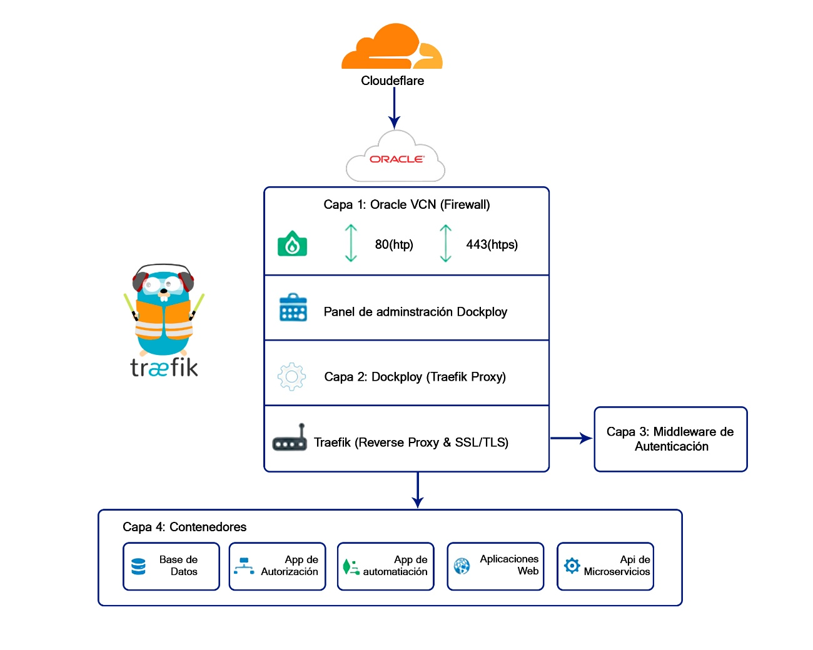
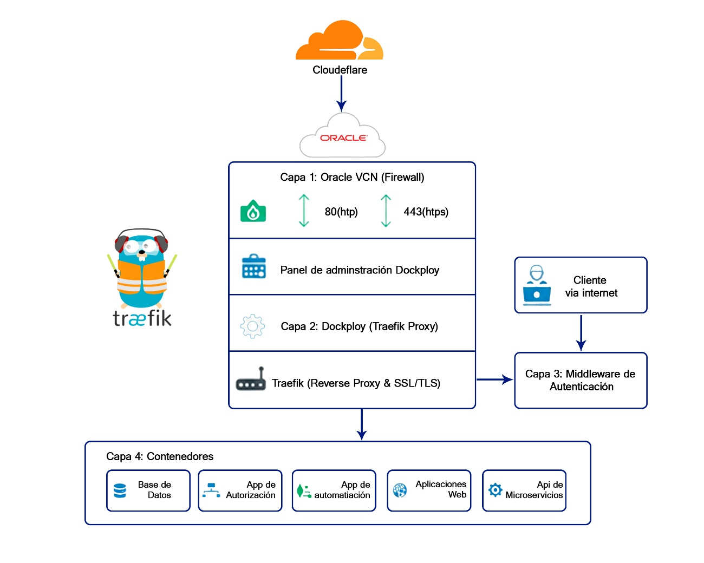

# Gestión de VPS en Oracle Cloud con Dokploy y Autenticación Centralizada

Este documento describe una arquitectura segura y escalable para gestionar un VPS en Oracle Cloud utilizando Dokploy como plataforma de despliegue, incorporando un sistema de autenticación centralizada y múltiples capas de seguridad.

## Objetivo del Sistema

El objetivo es desplegar y administrar múltiples servicios dentro de un VPS de Oracle Cloud usando Dokploy, asegurando que el acceso a dichos servicios esté protegido mediante autenticación y controles de seguridad a nivel de red, sistema y aplicación.

- Gestión centralizada de servicios con Dokploy

- Autenticación obligatoria para acceder a cualquier servicio

- Protección contra accesos no autorizados y ataques comunes

## Gestión de Traerfik

En esta arquitectura, la gestión del dominio se realiza mediante **Cloudflare**, lo que permite centralizar el acceso a los servicios y mejorar la seguridad. Gracias a esta configuración, únicamente se exponen los puertos **80 (HTTP)** y **443 (HTTPS)**, reduciendo significativamente la superficie de ataque y evitando la exposición innecesaria de otros puertos del VPS.

La administración de los servicios y APIs se lleva a cabo a través de **Traefik**, que actúa como proxy inverso. Desde Traefik no solo se gestiona el enrutamiento por dominio y subdominio, sino también la distribución del tráfico hacia los distintos contenedores desplegados. Además, permite integrar mecanismos de registro (logs), facilitando el monitoreo de las solicitudes, la detección de comportamientos anómalos y la identificación de posibles ataques.

Adicionalmente, dentro de esta capa se pueden implementar configuraciones para el manejo de errores del servidor (códigos **5xx**), reemplazando las respuestas por páginas personalizadas. Esto evita la exposición de información sensible, como trazas de errores o detalles internos del sistema, fortaleciendo así la seguridad de la infraestructura.

## Arquitectura del Sistema

La siguiente estructura garantiza que tus servicios no estén expuestos directamente a internet, sino protegidos por una capa de identidad.

- **Capa 1: Oracle VCN (Firewall):** Solo permite los puertos 80 (HTTP) y 443 (HTTPS).

- **Capa 2: Dokploy (Traefik- Dokploy):** Actúa como la puerta de entrada principal, es parte se puede configurar manual con traefik, pero la mejor opción es configurar el proxy dentro de Dokploy, esta será complementada con la gestión de seguridad de cloudeflare esto para hacer uso de su gestión de seguridad.

- **Capa 3: Middleware:** Sistema que solicita usuario, contraseña y 2FA (segundo factor).

- **Capa 4: Contenedores:** Tus apps (n8n, bases de datos, webs) corren de forma aislada.

## Arquitectura de Usuario

La arquitectura se basa en un modelo de proxy inverso con autenticación obligatoria antes de acceder a los servicios internos. Dokploy administra los contenedores y el proxy, cloudflare se encarga de la gestión del dominio, mientras que el traefik se encarga de la gestión de servicios y redirección de dominio para no exponer todo el servidor solo únicamente el puerto (80,443), mientras que un servicio de autenticación controla el acceso:

- **Cliente:** Conexión de usuario.

- **HTTPS:** Protocolo de trasferencia de datos vía internet.

- **Dokploy (Traefik - Dokploy):** Primera etapa de autenticación, se revisa que no sea algún ataque de los que se van especificar mas adelante.

- **Middleware**: Autentificación por el servidor de autenticación este puede ir variado dependiendo del temple que ocupemos dentro de dokpoy.

<!-- -->

- **Contenedores:** Tus apps (n8n, bases de datos, webs) corren de forma aislad

Consideración que se deben tener en cuenta:

- La gestión de puertos para el despliegue de servicios se administra por traefik.

- Los servicios internos no son accesibles directamente

- La autenticación es centralizada y reutilizable

## Flujo de Acceso a los Servicios

El flujo de acceso garantiza que ningún cliente pueda consumir un servicio sin haber sido autenticado correctamente. Este proceso se ejecuta de forma transparente para los servicios internos. Flujo detallado:

- El cliente solicita acceso a un servicio protegido

- El proxy verifica si existe un token válido

- Si no existe, redirige al servicio de autenticación

- El usuario se autentica y recibe un token JWT

- El cliente reintenta la solicitud con el token

- El proxy permite el acceso al servicio interna

La autenticación se realizar con Autehelia ya que viene siendo la opción más viable debido a los recursos tecnológicos que se posee además de ser una herramienta de código abierto.

## Seguridad del Servidor (SSH)

- Deshabilitar autenticación por contraseña

- Usar claves SSH y rotarlas periódicamente

- Cambiar el puerto SSH por defecto

<!-- -->

- Puerto cambiando 2222

- ssh -i ~/ssh-key-2026-05-06.key -p 2222 opc@149.130.182.3

<!-- -->

- Implementar Fail2Ban

## Protección y monitoreo contra Inyecciones y Ataques Web

- Backups automáticos y verificados

Cloudflare incluye un **WAF (Web Application Firewall)** que analiza cada petición antes de que llegue a tu servidor.

- Bloquear si detecta SELECT, UNION, etc.

- Proteger rutas específicas (/api/login)

<!-- -->

- Monitoreo y alertas

<!-- -->

- Prometheus: CPU, RAM, Requests , Latencia de tus APIs.

- Grafana: Dashboards en tiempo real, Gráficas de tráfico, errores, uso.

- Loki: Centraliza los logs de traefik, servicios y apis.

<!-- -->

- Principio de mínimo privilegio

- Separación de entornos (dev, staging, prod)

## Configuración de Seguridad y Mitigación de Ataques

<table>
<colgroup>
<col style="width: 20%" />
<col style="width: 25%" />
<col style="width: 54%" />
</colgroup>
<thead>
<tr class="header">
<th><strong>Tipo de Ataque</strong></th>
<th><strong>Estrategia de Mitigación</strong></th>
<th><strong>Implementación</strong></th>
</tr>
</thead>
<tbody>
<tr class="odd">
<td>Fuerza Bruta (SSH)</td>
<td>Deshabilitar contraseñas.</td>
<td><ul>
<li>
Usa solo SSH Keys. Cambia el puerto 22 por uno como el 2222.
</li>
<li>
Instala fail2ban en el VPS para bloquear IPs que fallen 3 veces al intentar entrar por SSH.
</li>
</ul></td>
</tr>
<tr class="even">
<td>DDoS / Inundación</td>
<td>Proxy Inverso + Oracle Cloud</td>
<td>Oracle ofrece protección básica. Usa Cloudflare como DNS para ocultar tu IP real.</td>
</tr>
<tr class="odd">
<td>Secuestro de Sesión</td>
<td>Autenticación 2FA</td>
<td>Configura Authelia con TOTP (Google Authenticator).</td>
</tr>
<tr class="even">
<td>Exploits de Aplicación</td>
<td>Aislamiento de Red</td>
<td>En Dokploy, no expongas puertos de bases de datos al exterior. Usa solo la red interna de Docker.</td>
</tr>
<tr class="odd">
<td>Inyección de Scripts</td>
<td>Security Headers</td>
<td>En la sección de Middlewares de Dokploy, activa "Security Headers" (HSTS, X-Frame-Options).</td>
</tr>
</tbody>
</table>

## Sugerencias Pertinentes para Oracle Cloud

- **Limpieza de Reglas de Oracle:** Oracle Cloud por defecto bloquea casi todo. Para que Dokploy funcione bien, usa estos comandos en tu terminal para evitar conflictos con el firewall interno:

> \# Permitir conexiones ya establecidas
>
> iptables -A INPUT -m conntrack --ctstate ESTABLISHED,RELATED -j ACCEPT
>
> \# Permitir loopback
>
> iptables -A INPUT -i lo -j ACCEPT
>
> \# HTTP / HTTPS
>
> iptables -A INPUT -p tcp --dport 80 -j ACCEPT
>
> iptables -A INPUT -p tcp --dport 443 -j ACCEPT
>
> \# SSH (opcional y restringido)
>
> iptables -A INPUT -p tcp --dport 22 -j ACCEPT
>
> Al solo permitir el puerto 80 y 443, y al usar traefik y cloudflare hacemos la gestión desde ahí y no exponemos el servidor.

- **Uso de Volúmenes:** No guardes datos importantes dentro del contenedor. Usa la sección de **Volumes** en Dokploy para mapear carpetas del VPS. Así, si borras el contenedor, tus datos siguen a salvo en el disco de Oracle.

- **Monitoreo:** Activa las alertas de salud en Dokploy para que te notifique si un servicio se detiene debido a falta de memoria en el VPS.  
  **No expongas el panel de Dokploy:** Una vez configurado tu dominio, usa el propio Dokploy para ponerle una capa de "Basic Auth" al puerto 3000. Así, nadie podrá siquiera ver tu pantalla de login de administración.

- **Habilitar Swap:** Aunque tengas mucha RAM, en Oracle Linux/Ubuntu es vital crear un archivo Swap de unos 4GB para evitar que el sistema mate procesos (OOM Killer) durante despliegues pesados.

# Estrategia de Respaldos del VPS

Debido a que el VPS alberga un servidor de gestión de contraseñas (**Passbolt**), la generación de respaldos no se realiza de forma convencional, sino mediante procedimientos específicos según el tipo de datos:

## 1. Respaldos de Passbolt (Base de Datos)
* **Destino:** Bucket de Cloudflare R2.
* **Herramientas:** `rclone` y utilidades de respaldo de Passbolt.
* **Procedimiento:** 
  1. Se genera la copia de seguridad de la base de datos del servicio Passbolt.
  2. El archivo se **encripta** previamente antes del envío.
  3. Se sincroniza/sube de forma segura hacia el bucket de Cloudflare R2 mediante `rclone`.

## 2. Respaldos Completos del VPS (Imágenes/Sistema)
* **Destino:** Google Drive (seleccionado por capacidad de almacenamiento).
* **Frecuencia:** Mensual.
* **Procedimiento:** 
  1. Se sigue la misma lógica de automatización y cifrado.
  2. El respaldo completo se **encripta siempre** antes de ser subido.
  3. Una vez verificada la subida del nuevo respaldo a Google Drive, se **elimina automáticamente la copia del mes anterior** para optimizar el espacio.
