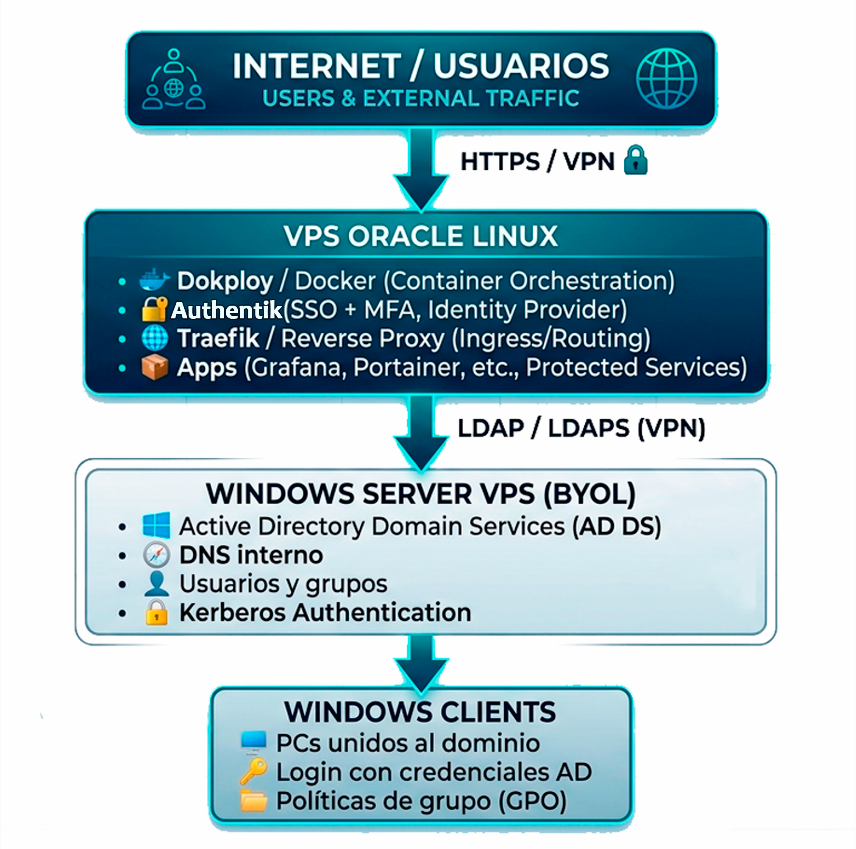
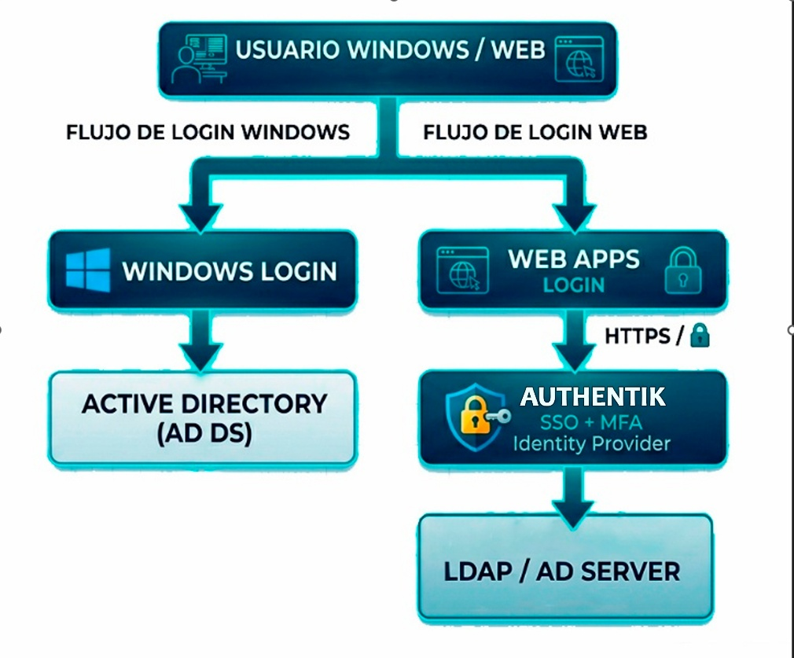
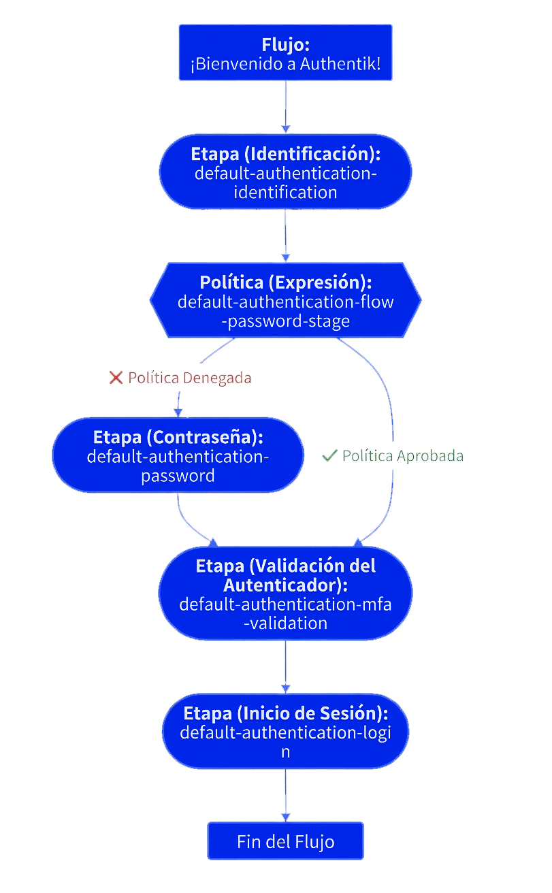

**Arquitectura de Identidad y Acceso (AD + Authentik+ VPS Linux)**

La siguiente arquitectura describe la implementación de un sistema centralizado de administración de reglas y políticas a nivel empresarial. La gestión principal se realizará mediante Active Directory sobre Windows Server, permitiendo la administración centralizada de usuarios, permisos y recursos de la organización.

Adicionalmente, la infraestructura se complementará con Authentik desplegado en un entorno Linux utilizando Docker y Dokploy, proporcionando una capa de autenticación unificada mediante SSO (Single Sign-On). De esta manera, la gestión de usuarios y el control de acceso estarán centralizados, mejorando la seguridad, la escalabilidad y la administración de la infraestructura empresarial.

**Arquitectura General**

**Flujo de autenticación**

**Componentes del sistema**

**Windows Server VPS (Identidad central)**

La arquitectura estará centralizada en Windows Server, por lo que toda la administración de usuarios y recursos se gestionará desde esta plataforma. La infraestructura utilizará Active Directory Domain Services (AD DS) como servicio principal de directorio, junto con un servidor DNS interno y autenticación mediante Kerberos.

Dentro de esta arquitectura se administrarán de forma centralizada los usuarios, grupos y políticas de dominio (GPO), permitiendo un mayor control sobre los accesos, configuraciones y recursos de la organización. Esto facilitará la aplicación de políticas empresariales, el fortalecimiento de la seguridad y una administración más eficiente de toda la infraestructura tecnológica.

**VPS Oracle Linux (Plataforma de Servicios)**

El VPS basado en Oracle Linux funcionará como una plataforma independiente destinada al despliegue y administración de servicios empresariales. La separación entre este entorno y Windows Server permitirá mantener aislada la gestión de servicios de la administración del dominio corporativo, mejorando la organización, la seguridad y la escalabilidad de la infraestructura.

Sin embargo, aunque ambos servidores operarán de forma independiente, será necesaria la comunicación entre ellos para el proceso de autenticación centralizada. Para ello, Authentik actuará como la capa de autenticación SSO (Single Sign-On), utilizando como fuente principal de usuarios a Active Directory Domain Services.

De esta manera, Authentik no administrará usuarios locales, sino que validará las credenciales directamente contra el Active Directory mediante protocolos de autenticación y directorio, como LDAP/LDAPS y Kerberos. Esto permitirá que los usuarios gestionados desde Windows Server puedan acceder de manera unificada y segura a los servicios desplegados en el VPS Linux, manteniendo una administración centralizada de identidades y accesos.

**Authentik (Capa de acceso)**

Aunque ya se dispone de Active Directory Domain Services para la gestión centralizada de usuarios, inicialmente se podría considerar que Authelia no sería necesario dentro de la arquitectura. Sin embargo, Active Directory se encarga principalmente de la administración de identidades, mientras que aún es necesario contar con una capa adicional que controle y proteja el acceso a los diferentes servicios empresariales.

En este contexto, Authentik cumple el rol de portal de autenticación y autorización, actuando como intermediario antes de permitir el acceso a las aplicaciones y servicios desplegados en la infraestructura. Gracias a su integración mediante LDAP con Active Directory, Authentik puede validar las credenciales de los usuarios utilizando las cuentas corporativas ya existentes, evitando la duplicación de usuarios y manteniendo la administración centralizada.

Además, Authentik proporciona un sistema de autenticación unificada mediante SSO (Single Sign-On), permitiendo que los usuarios inicien sesión una sola vez y puedan acceder de forma segura a múltiples servicios sin necesidad de autenticarse repetidamente. Esto mejora tanto la seguridad como la experiencia de usuario dentro de la arquitectura empresarial.

**Requisitos obligatorios de la arquitectura**

Para garantizar una comunicación segura entre los VPS y el entorno de directorio, es indispensable la implementación de una VPN site-to-site entre servidores, asegurando un canal privado y cifrado entre Windows Server y Oracle Linux. Esta VPN será el único medio autorizado para la comunicación entre ambos entornos.

La conectividad entre servicios de autenticación se basará en la integración de Active Directory Domain Services con authentik mediante LDAP/LDAPS, asegurando que el tráfico de autenticación viaje exclusivamente a través del túnel VPN.

**Restricciones de seguridad (obligatorias)**

-   **Prohibido exponer Active Directory a Internet bajo cualquier circunstancia.\
    **AD DS no debe tener accesibilidad pública directa, ya que es un activo crítico de la infraestructura.

-   **Prohibido el acceso a LDAP fuera del túnel VPN.\
    **El servicio LDAP/LDAPS únicamente podrá ser accesible desde la red privada establecida entre VPS.

-   **Authentik no debe crear ni almacenar usuarios locales.\
    **Todo usuario debe ser autenticado exclusivamente contra Active Directory, evitando duplicidad de identidades y posibles inconsistencias en la gestión de accesos.

-   **Kerberos debe operar únicamente dentro del entorno interno seguro.\
    **La autenticación mediante Kerberos será válida solo dentro del dominio y a través de la red protegida por VPN.

-   **Restricciones estrictas de firewall.\
    **Solo se permitirán puertos y servicios necesarios para la comunicación entre VPN, AD DS y Authentik. Todo tráfico externo no autorizado debe ser bloqueado por defecto.

**Consideración arquitectónica clave**

Aunque en teoría podría parecer viable prescindir de la VPN si se expusiera LDAP directamente, esta práctica está totalmente prohibida dentro del diseño propuesto, ya que comprometería la seguridad del dominio. La VPN es un componente obligatorio que garantiza confidencialidad, integridad y control del acceso entre ambos VPS.

**Recursos Tecnológicos**

La arquitectura propuesta se apoya en dos entornos de servidores independientes para garantizar una administración eficiente, escalable y segura de los servicios empresariales. Por un lado, se utiliza un VPS basado en Windows Server, el cual está destinado principalmente a la gestión centralizada de identidades y servicios de dominio mediante Active Directory Domain Services. Este enfoque permite una administración más nativa, estable y optimizada para entornos empresariales.

Por otro lado, se implementa un VPS basado en Oracle Linux, orientado a la ejecución de servicios de aplicación y componentes adicionales de la infraestructura, como herramientas open source y servicios de autenticación complementarios como Authentik. Si bien es posible centralizar múltiples servicios en un único entorno Linux, en arquitecturas de mayor escala esto puede generar limitaciones en recursos y afectar la escalabilidad del sistema, por lo que la separación de entornos resulta una estrategia más eficiente.

Esta distribución de recursos permite dividir la carga de procesamiento y almacenamiento entre ambos servidores, optimizando el rendimiento general del sistema y facilitando su crecimiento futuro.

**Especificación de recursos**

**Windows Server (AD DS):**

-   2 vCPU

-   4 GB RAM

-   500 GB SSD

**Oracle Linux (Servicios):**

-   2 a 4 vCPU

-   4 a 16 GB RAM

-   60 a 150 GB SSD

Esta distribución asegura que el entorno de directorio tenga recursos estables y dedicados, mientras que el entorno de servicios en Linux mantenga flexibilidad para escalar según la demanda de la arquitectura.

**Configuración de Usuarios**

Una vez implementada la arquitectura, se procederá a la creación y gestión de usuarios con distintos niveles de privilegios dentro de Active Directory Domain Services. Cada usuario será definido con roles específicos, lo que permitirá establecer un control granular sobre los accesos, permisos y recursos disponibles dentro de la organización.

Para la gestión del correo electrónico y servicios asociados, se propone la integración con Google Workspace, aprovechando una base de usuarios ya estructurada. De esta forma, será posible sincronizar las cuentas existentes en el directorio con el servicio de correo, facilitando la administración y evitando la duplicación de identidades.

**Privilegios dentro de Active Directory**

Dentro del entorno de AD DS, la administración de usuarios incluirá los siguientes privilegios principales:

-   Creación y eliminación de usuarios

-   Asignación y gestión de grupos

-   Control de acceso a servicios según grupos y políticas

-   Deshabilitación de cuentas de usuario

-   Cambio y restablecimiento de contraseñas

-   Administración de políticas de dominio mediante GPO (Group Policy Objects)

Este modelo de configuración permite mantener una administración centralizada, segura y escalable, garantizando un control eficiente sobre los recursos y accesos dentro de la infraestructura empresarial.\
\
**Implementación del Sistema de Autenticación y Control de Acceso**

Para el despliegue inmediato del sistema de autenticación y autorización, se plantea una estrategia de implementación dividida en dos etapas secuenciales. El objetivo central es centralizar la gestión de identidades, reforzar la seguridad de los servicios críticos expuestos e integrar la infraestructura on-premises y en la nube.

**Etapa 1: Implementación en Servidor Oracle Linux (Autenticación Central con Authentik)**

En esta primera fase se despliega **Authentik** como Proveedor de Identidad (IdP) centralizado para la gestión de autenticación y autorización de usuarios.

-   **Middleware de Seguridad:** Authentik actúa como una capa intermedia (middleware) de autenticación para servicios críticos. Esto impide la exposición directa a Internet de aplicaciones que carecen de validación de entrada propia o que requieren un segundo factor de autenticación (2FA/MFA) para elevar su nivel de protección.

-   **Flujo de Autenticación y Registro:**

    -   **Primer Inicio de Sesión:** El usuario debe realizar la vinculación inicial de una aplicación de autenticación (TOTP) para generar códigos de acceso temporales.

    -   **Accesos Subsecuentes:** Validación continua mediante credenciales e ingreso del código TOTP.

-   **Control de Acceso Basado en Roles (RBAC):**

    -   Se implementa la segmentación de usuarios mediante **Grupos y Roles**, garantizando el principio de menor privilegio.

    -   Permite aplicar políticas de acceso detalladas según el rol operativo y los servicios requeridos por cada usuario.

-   **Gestión y Accesos Administrativos:**

    -   **Consola de Authentik:** authentik.seius.com.ec

    -   **Gestión de Credenciales (Bóveda):** passbolt.seius.com.ec

**3. Etapa 2: Implementación en Servidor Windows Hostup e Integración Multidominio**

La segunda fase se enfoca en la expansión del dominio de identidad y la interconexión segura entre infraestructuras.

-   **Active Directory Domain Services (AD DS):**

    -   Despliegue de un Controlador de Dominio (AD DC) sobre Windows Server.

    -   Sincronización y vinculación con la arquitectura desplegada en el servidor Oracle Linux mediante Authentik (LDAP/Outpost).

-   **Interconexión Segura (Site-to-Site / Service-to-Service):**

    -   Configuración de túneles VPN dedicados mediante **WireGuard** para interconectar de forma cifrada el servidor Windows Hostup con la infraestructura en Oracle Linux.

-   **Integración con Google Workspace:**

    -   Vinculación de identidades con Google Workspace para habilitar Single Sign-On (SSO) y facilitar un acceso ágil y unificado a las herramientas de colaboración.

**4. Beneficios Principales de la Solución**

1.  **Reducción de la Superficie de Ataque:** Protección de servicios vulnerables mediante la capa de autenticación previa de Authentik.

2.  **Cero Confianza (Zero Trust Architecture):** Requisito obligatorio de MFA/TOTP para todos los usuarios.

3.  **Gestión Centralizada:** Unificación de identidades entre Oracle Linux, Windows Server (AD) y Google Workspace.

4.  **Comunicaciones Cifradas:** Tráfico de autenticación y gestión enrutado de forma segura a través de WireGuard.
