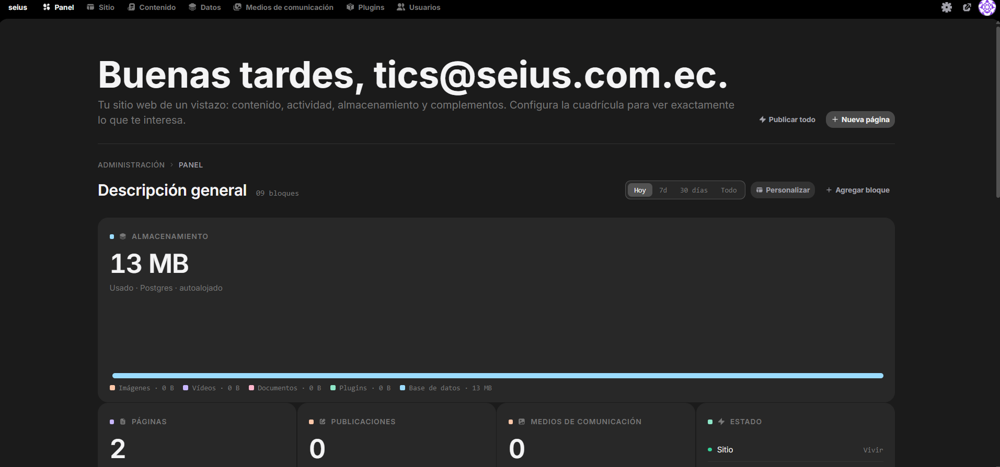

**Optimización de Infraestructura para Sitios Web Estáticos mediante Instatic**

Para optimizar el uso de recursos computacionales dentro del Servidor VPS de Oracle, se plantea la implementación de **Instatic** como plataforma especializada en el despliegue, edición y gestión centralizada de sitios web estáticos. Esta solución sustituye el esquema tradicional de despliegue individual por contenedores aislados (Docker Compose/Dokploy), reduciendo de manera drástica el consumo de RAM y CPU al alojar múltiples páginas sobre una misma arquitectura ligera.

El despliegue de páginas estáticas mediante contenedores independientes en Dokploy o instancias individuales de Docker Compose genera una sobrecarga (*overhead*) innecesaria:

-   **Consumo Excesivo de Recursos:** Cada sitio web requiere un motor o servidor web dedicado en su propio contenedor, multiplicando el uso de memoria RAM y almacenamiento por procesos repetitivos.

-   **Falta de Centralización:** La administración, actualización de contenido y mantenimiento de múltiples páginas se vuelve fragmentada y difícil de escalar.

**Ventajas de Instatic**

-   **Eficiencia de Servidor:** Agrupa y sirve múltiples sitios estáticos desde un único punto de control, optimizando la capacidad operativa del VPS Oracle.

-   **Gestión Integrada:** Ofrece edición de contenido, gestión de usuarios con control de accesos y administración centralizada sin depender de infraestructura pesada para cada proyecto.

**Arquitectura del Despliegue**

```
            [ Tráfico Web (HTTP/HTTPS) ]
                        │
                        ▼
                [ Proxy Inverso ]
                        │
                        ▼
        ┌───────────────────────────┐
        │     Instancia Instatic    │
        │   (VPS Oracle - Docker)   │
        └─────────────┬─────────────┘
                      │
      ┌───────────────┼───────────────┐
      ▼               ▼               ▼
┌───────────┐   ┌───────────┐   ┌───────────┐
│ Sitio Web │   │ Sitio Web │   │ Sitio Web │
│     A     │   │     B     │   │     C     │
└───────────┘   └───────────┘   └───────────┘
```

**Componentes Clave:**

1.  **Entorno de Ejecución:** Despliegue de servicio único en la instancia VPS de Oracle.

2.  **Control de Acceso (RBAC):** Módulo de gestión de usuarios para delimitar permisos de edición y administración por cada sitio alojado.

**Beneficios Operativos**

-   **Ahorro de Infraestructura:** Reducción sustancial en la huella de memoria en el servidor Oracle al evitar el *overhead* de múltiples contenedores web.

-   **Escalabilidad Simplificada:** Inclusión inmediata de nuevos sitios web estáticos sin necesidad de aprovisionar infraestructura adicional.

-   **Mantenimiento Centralizado:** Edición directa y gestión de actualizaciones desde un panel único.


