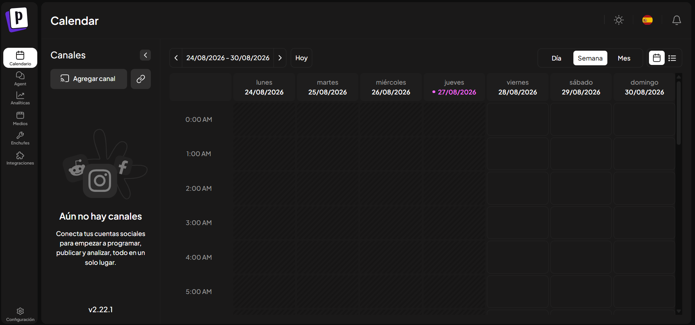

Despliegue de Plataforma de Gestión de Redes Sociales (Postiz)

Dentro de los alcances de administración del servidor Oracle, se incluye la gestión centralizada y automatizada de redes sociales. Para cumplir con este objetivo, se ha seleccionado **Postiz**, una plataforma *open-source* y autohospedada (*self-hosted*) de alto rendimiento. El acceso a la consola de control se estructurará bajo el FQDN postiz.seius.com.ec, implementando directivas de seguridad para el manejo estricto de secretos y credenciales de API.

La elección de Postiz responde a la necesidad de contar con una herramienta robusta de publicación, programación y analítica sin depender de servicios de terceros que comprometan el control de datos:

-   **Gestión Centralizada:** Permite administrar múltiples perfiles sociales desde un único panel administrativo.

-   **Autohospedaje (*Self-Hosted*):** Garantiza soberanía total sobre los datos, métricas y registros generados.

**Arquitectura de Despliegue y Acceso**

**Infraestructura y Enrutamiento**

-   **Servidor Anfitrión:** Instancia en infraestructura Oracle.

-   **Dominio de Acceso:** postiz.seius.com.ec (configurado mediante Proxy Inverso con terminación TLS/SSL para cifrado en tránsito).

-   **Contenerización:** Despliegue en contenedores aislados para facilitar el mantenimiento y escalabilidad del servicio.

**Seguridad y Manejo de Variables de Entorno**

Para prevenir fugas de información crítica se establece la siguiente política de configuración:

-   **Aislamiento de Secretos:** Queda **estrictamente prohibido** hardcodear tokens de acceso, API keys o credenciales directamente en el archivo docker-compose.yml.

-   **Uso de Archivos .env:** Todos los tokens de autenticación de las redes sociales deberán gestionarse mediante variables de entorno almacenadas en archivos .

