# Servidor de VPN dentro del VPS

Dentro del VPS se encuentra alojado un servidor VPN, el cual es fundamental para la creación de redes virtuales seguras. Estas redes permiten la comunicación entre el VPS y los routers donde están conectados distintos medidores.

El objetivo de esta infraestructura es establecer un canal seguro para la

recopilación y el tratamiento de datos provenientes de los medidores, de manera que la información procesada pueda visualizarse y gestionarse correctamente en el sistema PME.

La arquitectura de red se encuentra distribuida de la siguiente manera:

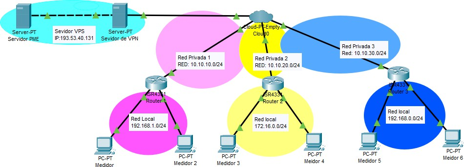

Arquitectura del VPS con distintas redes privadas.

En la imagen se presenta la arquitectura de la infraestructura con la

implementación de redes privadas virtuales. En este esquema, el servidor VPS cumple el rol de servidor VPN centralizado.

Se optó por esta arquitectura debido a que resulta más viable en términos de escalabilidad, administración e implementación. Al centralizar el servicio VPN en el VPS, se simplifica la gestión de conexiones y el crecimiento futuro de la red.

En contraste, si cada router funcionara como servidor VPN, sería necesario que cada uno disponga de salida directa a Internet y de una dirección IP pública, lo que incrementaría la complejidad, los costos y la exposición a riesgos de seguridad.

## Implementación de una Red Privada

Para implementar el servidor VPN o crear una nueva red virtual dentro del mismo VPS, se deben seguir los siguientes pasos:

### Instalación de WireGuard

En caso de que el servidor VPS no tenga instalado WireGuard, se deberá proceder con su instalación desde el sitio oficial:

<https://www.wireguard.com/install/>

Es importante verificar que la instalación se haya completado correctamente antes de continuar con la configuración del túnel.

### Creación de un nuevo túnel

Una vez instalado WireGuard, se deberá crear un nuevo túnel, el cual denominaremos:

**Servidor_VPN**

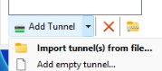

Creación de un nuevo túnel como Servidor.

Al momento de crear el túnel, WireGuard genera automáticamente:

-   Una **clave privada (PrivateKey)**

-   Una **clave pública (PublicKey)**

Es fundamental **no eliminar ni modificar estas claves**, ya que son esenciales para la configuración y el establecimiento seguro de la comunicación.

WireGuard generará un archivo de configuración base similar al siguiente:

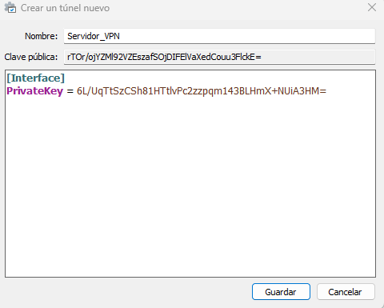

Script de conexión por defecto.

Dentro de ello nosotros solo agregaremos nuestras configuraciones, nuestro documento final debería verse algo así:

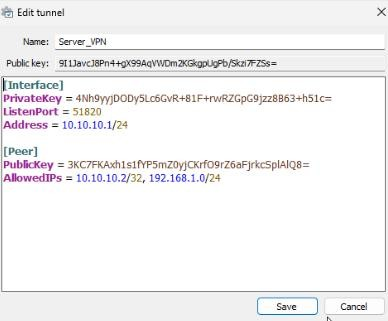

Script completo para la conexión por túnel.

### Parámetros

-   **PrivateKey**: Se genera automáticamente al crear el túnel. No debe modificarse.

-   **Address**: Corresponde a la IP del servidor dentro de la red privada. Para este caso se utilizará el esquema 10.10.x.1/24, donde el valor de **x** variará según la red virtual que se desee crear.

-   **PublicKey**: Es la clave pública del router cliente que se conectará al VPS.

-   **AllowedIPs**: Define las redes o direcciones IP que estarán autorizadas a comunicarse a través del túnel.

En este caso:

-   10.10.10.2/32 → IP del cliente dentro de la red VPN.

-   192.168.1.0/24 → Red local del router donde se encuentran los dispositivos (por ejemplo, medidores).

Si se requiere que las redes estén completamente aisladas entre sí, existen dos alternativas:

1.  **Crear un túnel independiente para cada red**, lo que garantiza un aislamiento total a nivel de configuración.

2.  **Restringir las direcciones en el parámetro AllowedIPs**,

permitiendo únicamente el tráfico hacia la IP específica del router de destino.

De esta manera, el cliente solo podrá comunicarse con la IP autorizada y no con otras direcciones que compartan el mismo túnel.

## Configuración del router cliente (Teltonika Networks RUT421)

Una vez creada la configuración en el servidor VPS, **no se debe activar el túnel todavía**.

Antes de ello, es necesario realizar la configuración correspondiente en el router cliente.

En este caso se utiliza un router RUT421 de Teltonika Networks, el cual cuenta con soporte para VPN mediante WireGuard. No obstante, cualquier router que se

utilice deberá seguir el mismo estándar de configuración.

### Creación de la instancia WireGuard

Dentro de la interfaz del router, se debe acceder a:

**Services \> VPN \> WireGuard**

Posteriormente, se deberá añadir una nueva instancia. El nombre puede ser, por ejemplo:

wg_server (o cualquier nombre descriptivo).

Nota: Aunque la estructura de configuración en WireGuard es similar tanto para cliente como para servidor, conceptualmente cumplen funciones

distintas. En este caso, el router actuará como cliente del servidor VPN alojado en el VPS.

### Configuración de la interfaz

Una vez creada la instancia, se deberá configurar de la siguiente manera:

-   **PrivateKey**: Será la clave privada generada por el router (cliente).

-   **PublicKey**: Es la clave pública asociada a esa clave privada.

Esta clave pública deberá copiarse en la configuración del servidor VPS, específicamente en la sección \[Peer\].

-   **IP Address**: 10.10.10.2/24

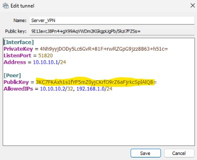

Configuración de clave publica del cliente.

Consideraciones importantes:

-   La IP asignada debe pertenecer al rango de la red privada configurada en el servidor (por ejemplo, 10.10.10.0/24).

-   No debe coincidir con la IP configurada en el servidor (10.10.10.1).

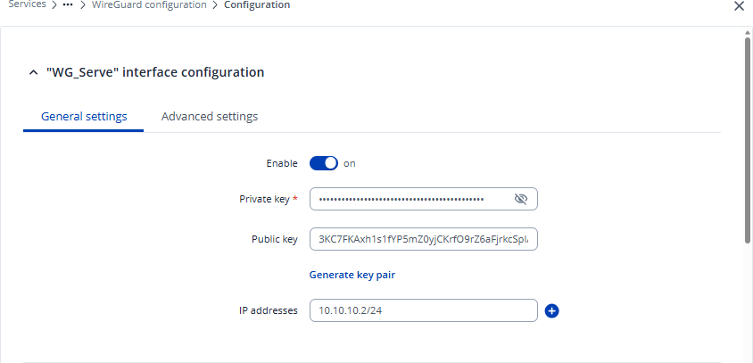

Configuración del túnel desde el cliente.

### Creación del Peer (cliente hacia el VPS)

Después de configurar la interfaz, se debe añadir un nuevo **Peer**, el cual tendrá los siguientes parámetros:

-   **PublicKey**: Será la clave pública generada por el servidor VPN (VPS).

-   **Endpoint Host**: IP pública del VPS (por ejemplo: 193.53.40.131).

Es indispensable que el Endpoint Host sea una **IP pública válida**, de lo contrario el túnel no podrá establecer comunicación.

-   **AllowedIPs**:

    -   10.10.10.1/32 → IP privada del servidor VPN.

    -   192.168.1.0/24 → Red local del router donde se encuentran los dispositivos

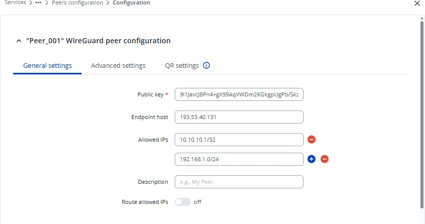

Configuración del ips y claves del túnel en el cliente.

Se debe tener especial cuidado **NO activar la opción \"Route Allowed IPs\"** (o Router Allowed IPs).

Si se habilita esta opción, todo el tráfico del router podría redirigirse a través del túnel VPN.

En caso de que no esté correctamente configurada la salida a Internet o el enrutamiento, esto podría provocar:

-   Pérdida de conectividad a Internet.

-   Pérdida de acceso a la interfaz de administración del router.

### Configuración avanzada

En la sección de configuraciones avanzadas se deberá establecer:

-   **Endpoint Port**: 51820

-   **Persistent Keepalive**: 25

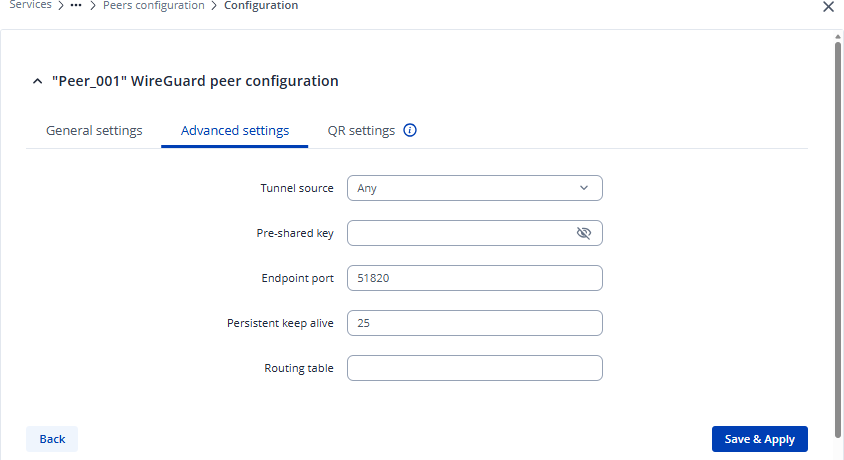

No es necesario realizar ninguna modificación en la sección **QR Settings**, ya que no es requerida para este tipo de implementación.

Configuraciones avanzadas del túnel en el cliente.

Una vez completada toda la configuración en el router, recién se podrá proceder a activar el túnel tanto en el VPS como en el router para verificar el establecimiento correcto de la conexión.

## Configuración de Firewall en el Router

Una vez activado el túnel tanto en el servidor (VPS) como en el router cliente, es posible que inicialmente no se observe tráfico de handshake.

Esto ocurre porque, antes de que pueda establecerse correctamente la comunicación, es necesario crear las reglas de firewall correspondientes que permitan el tráfico entre las zonas adecuadas.

Las reglas se deben configurar en: Network \> Firewall \> Traffic Rules

### Permitir acceso al router desde WireGuard

Esta regla es necesaria para permitir la administración y comunicación directa con el router desde la red VPN.

-   **Name:** Allow-WG-Input

-   **Source zone:** wg (o la zona donde esté asociada la interfaz WireGuard)

-   **Destination zone:** Device (o *This Device*)

-   **Action:** Accept

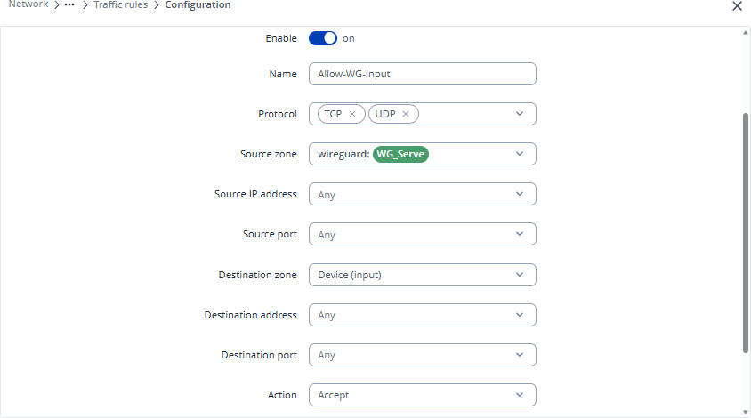

Regla de Permiso de acceso al router desde el wireguard.

### Permitir acceso a dispositivos detrás del router

Esta regla permite acceder a la red interna (LAN) donde se encuentran los dispositivos conectados al router.

-   **Name:** Allow-WG-Forward

-   **Source zone:** wg

-   **Destination zone:** lan

-   **Action:** Accept

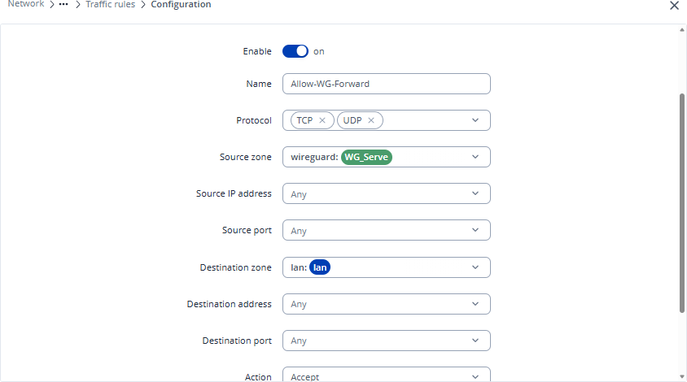

Regla de permisos de acceso a dispositivos dentro del router.

### Permitir conexiones entrantes de WireGuard

Esta regla es indispensable para que el router pueda aceptar conexiones WireGuard provenientes de Internet.

-   **Name:** Allow-WireGuard-In

-   **Action:** Accept

-   **Source zone:** wan

-   **Destination zone:** Device (Input)

-   **Protocol:** UDP

-   **Destination port:** 51820 (o el puerto configurado en el túnel)

Es importante verificar que el puerto configurado coincida exactamente con el definido en el servidor VPS.

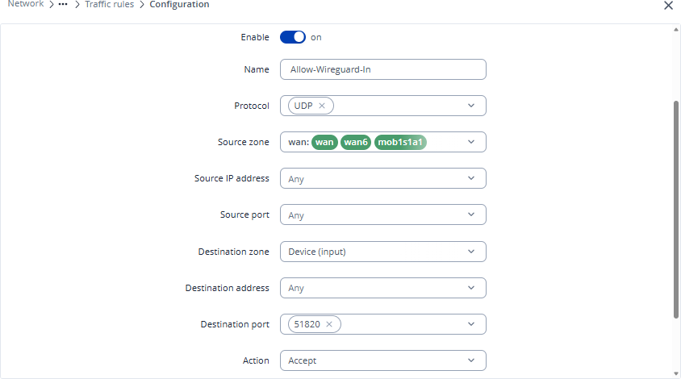

Regla de permisos de conexiones entrantes de wireguard.

### Configuración adicional en Firewall Zones

Además de las reglas de tráfico, es necesario realizar ciertos ajustes en:

**Network \> Firewall \> Zones Zona WireGuard → LAN**

En la zona correspondiente a WireGuard:

-   Se debe habilitar el **Forwarding** hacia la zona lan.

-   Activar la opción de permitir el tráfico interno (*Allow forwarding inside zone*, si aplica).

-   Guardar los cambios.

Esto permite que el router redirija correctamente el tráfico desde la VPN hacia la red interna.

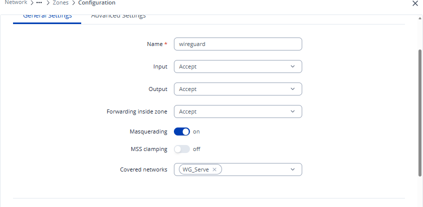

Configuración de redirección de tráfico dentro de Wireguard.

#### Zona WAN

En la zona wan se recomienda habilitar:

-   **MSS Clamping**

Esta opción ayuda a prevenir problemas de fragmentación de paquetes, especialmente en túneles VPN, mejorando la estabilidad de la conexión.

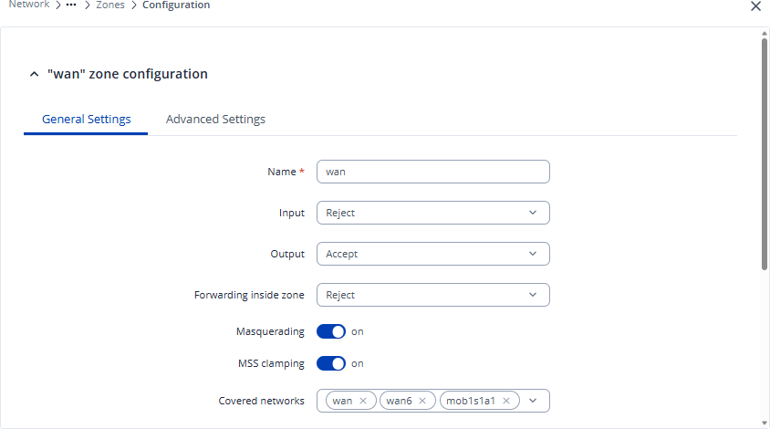

Configuración de redirección de tráfico dentro de Wan.

Una vez creadas todas las reglas y configuradas las zonas correctamente, se podrá verificar en el servidor VPN (VPS) que el túnel ya presenta tráfico de

**handshake**.

Un estado correcto debe mostrar:

-   Fecha reciente del último handshake.

-   Transferencia de datos (RX/TX).

-   Peer activo.

Si estos valores aparecen actualizados, significa que la comunicación entre el VPS y el router cliente está funcionando correctamente.

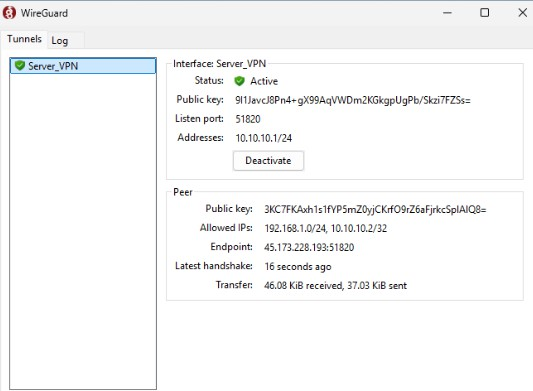

Status del servidor VPN cuando la compartición de datos es exitosa

## Despliegue de VPN de Alta Disponibilidad mediante WGDashboard

Para garantizar la continuidad operativa de los sistemas de Proveedor de Margen Eléctrico (PME) y satisfacer los requerimientos de sincronización periódica de datos cada minuto, se plantea la implementación de una infraestructura de red privada virtual (VPN) de alta disponibilidad. La solución se desplegará sobre un servidor Oracle y utilizará WireGuard administrado a través de la interfaz gráfica WGDashboard, optimizando la gestión de túneles seguros y la conectividad remota.

La topología de red existente cuenta con una estructura funcional interconectada a un enrutador principal y a un servidor con sistema operativo Windows Server.

### Limitaciones Identificadas

-   **Punto Único de Falla:** La arquitectura actual carece de redundancia explícita para la transferencia de datos en tiempo real.

-   **Frecuencia Critica de Transferencia:** La sincronización de información cada 60 segundos exige una latencia mínima y cero interrupciones en la transmisión.

-   **Gestión de Accesos:** Se requiere simplificar la administración de pares (*peers*) y políticas de acceso mediante una interfaz centralizada.

### Arquitectura de Red y Tecnologías

Se propone el despliegue de **WGDashboard** integrado con el protocolo **WireGuard** sobre la infraestructura cloud/on-premise de Oracle:

-   **Protocolo Base:** WireGuard (por su bajo consumo de recursos, cifrado moderno y rápido reestablecimiento de túneles).

-   **Gestión Grafica:** WGDashboard para administración de usuarios, monitoreo de tráfico en tiempo real y generación dinámica de configuraciones.

-   **Dominio y Acceso:** La consola de administración será accesible mediante el FQDN seguro wg.seius.com.ec utilizando HTTPS y proxy inverso.

### Componentes de la Arquitectura

1.  **Instancia Oracle Server:** Servidor anfitrión para el motor VPN y la interfaz de gestión.

2.  **Reverse Proxy & SSL:** Enrutamiento de peticiones web hacia WGDashboard bajo el subdominio wg.seius.com.ec con cifrado TLS/SSL.

3.  **Integración Lan/PME:** Interconexión con el router actual y el servidor Windows Server para permitir el flujo bidireccional seguro de las lecturas del PME.

### Requerimientos de Alta Disponibilidad

Para cumplir con el acuerdo de nivel de servicio (SLA) implícito en la transmisión por minuto:

-   **Failover y Redundancia:** Configuración de persistencia de estado de túneles (Keepalive) y monitoreo automatizado del servicio WireGuard.

-   **Respaldos de Configuración:** Exportación automatizada de las claves y perfiles del dashboard hacia un almacenamiento secundario.

-   **Políticas de Enrutamiento:** Definición de rutas estáticas y reglas de firewall (*iptables*) en la instancia de Oracle para asegurar el tráfico exclusivo del PME.

-   **Políticas de tráfico de red:** Definición de una regla de excepción para el puerto 51820 en cloudflare, este puerto es el puerto por defecto de wireguard, y para que tenga una salida directa a internet sin interferencia se debe definir esta regla de excepción.

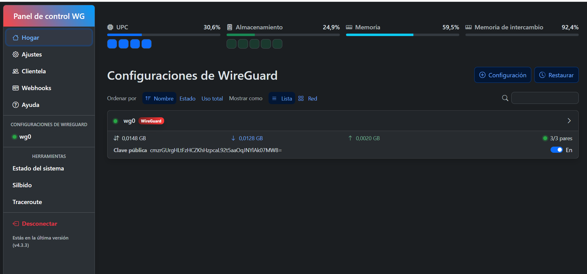
